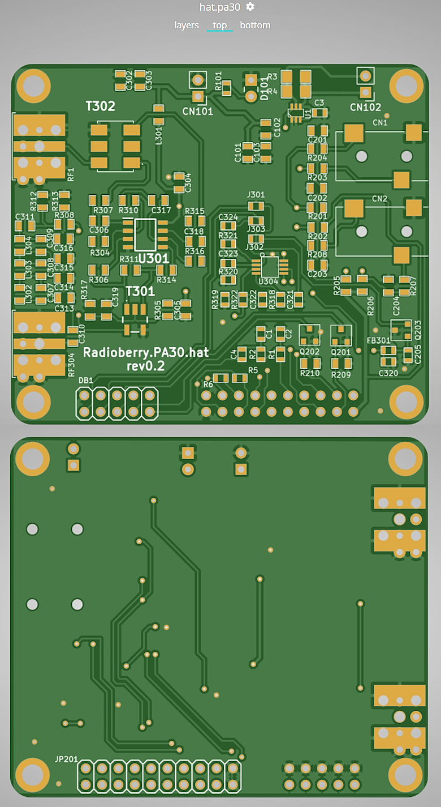
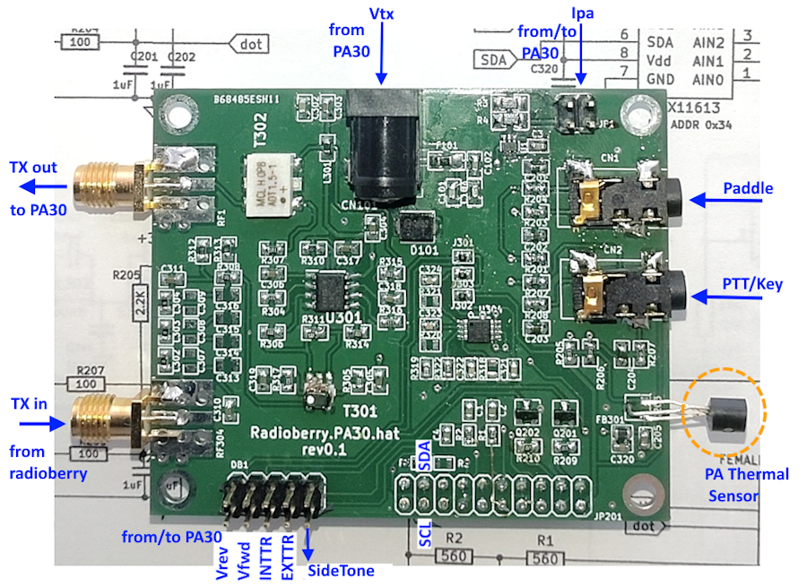
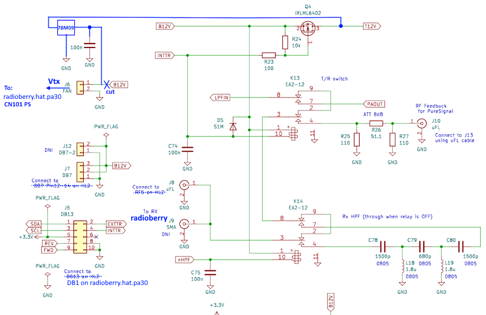

# [Radioberry_hat_pa30](https://github.com/hish8612/Radioberry_hat_pa30)

beta0.2 Release

This project provides a preamplifier to drive a [30W-PA (HL2-PA30 by ji1udd)](https://github.com/ji1udd/HL2-PA30) for Radioberry-2. It will be plugged on top of the radioberry-2. 

#### Feature
・Preamplifire(OPA2674) based on [radioberry.hat](https://github.com/pa3gsb/Radioberry-2.x/tree/master/hardware/hat) 
・On board ADC(MAX11613) for measuring pa-current, temperature and pa-fwd/rev from HL2-PA30 board.  
・Paddle or straight key inputs and PTT(Key) inputs. 
・No-latency sidetone output at [local CW operation.](https://github.com/hish8612/Hermes-Lite2/tree/master/gateware/variants/radioberry_cl025_cwsidetone) 

#### Board View

 

#### Connection diagram (beta0.1)

 

#### HL2-PA30 modifications.

// end item
